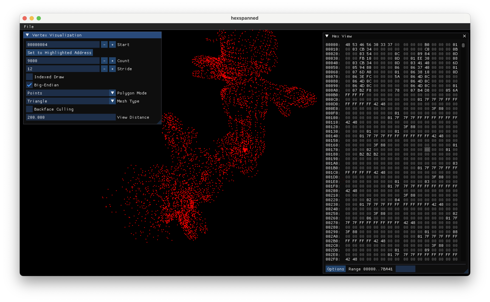

# hexspanned

This is a simple viewer program for visualizing floating-point mesh data embedded within a larger binary file.
Adjust the starting point, stride, endianness, and more and search around to find the data.

This may be useful for validating your assumptions when reverse-engineering a binary model format.

## License

This project is licensed under the MIT license.

## Compiling

Use vcpkg in manifest mode and cmake.
